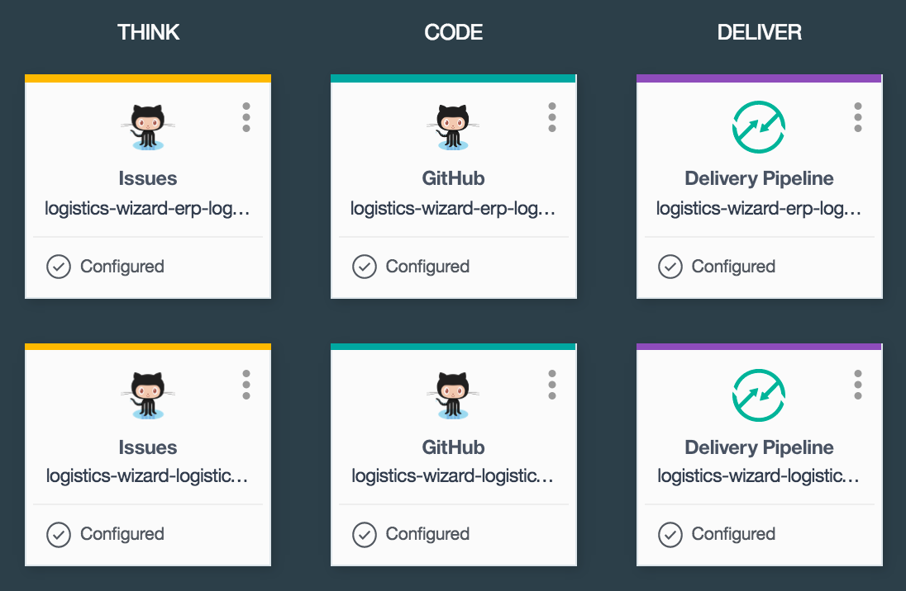

# Logistics Wizard Toolchain

This toolchain will allow you to deploy the entire Logistics Wizard demo system, which is a supply chain management web application composed of several microservices:  
- [Controller][github_controller_url] - The API that sits on the edge of the architecture and interfaces with all other services.  
- [ERP][github_erp_url] - An API that handles user login and interaction with the ERP system objects.  

The toolchain is preconfigured for:

- issue tracking
- source control
- continuous delivery and integration (CI/CD)
- unit and code coverage testing
- blue-green deployment

## Create the toolchain

**To get started, click this button:**  

### Setting up code coverage tests

To utilize the code coverage tests in the pipelines, you need add your repos to [coveralls][coveralls_url] and get the generated repo token. Once you get these tokens, go into each pipeline in the toolchain and populate the `COVERALLS_REPO_TOKEN` environment variables within the TEST stages.

---
### Learn more

* [Bluemix DevOps Services][bluemix_devops_url]
* [Bluemix Toolchains Documentation][toolchains_overview_url]
* [InterConnect 2016 video recording][toolchains_interconnect_video_url]

<!--Links-->
[bluemix_devops_url]: https://new-console.ng.bluemix.net/devops
[github_controller_url]: https://github.com/IBM-Bluemix/logistics-wizard
[github_erp_url]: https://github.com/IBM-Bluemix/logistics-wizard-erp
[coveralls_url]: https://coveralls.io/
[toolchains_overview_url]: https://new-console.ng.bluemix.net/docs/toolchains/toolchains_overview.html
[toolchains_interconnect_video_url]: https://vimeo.com/156126035/8b04b8878a